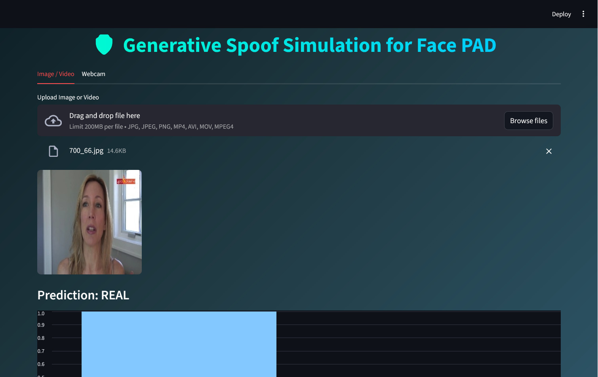
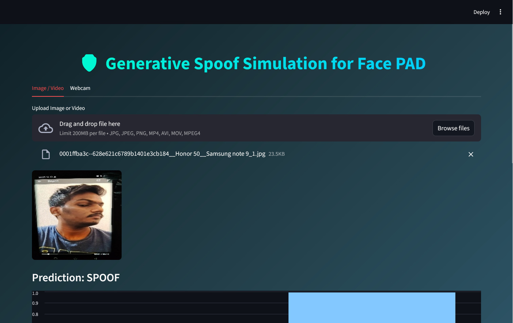
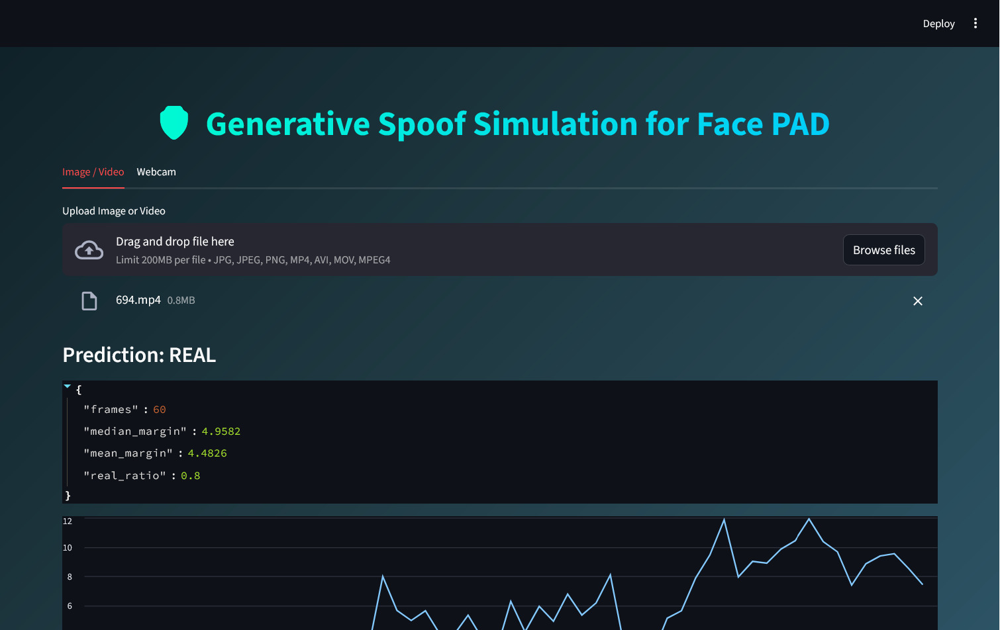
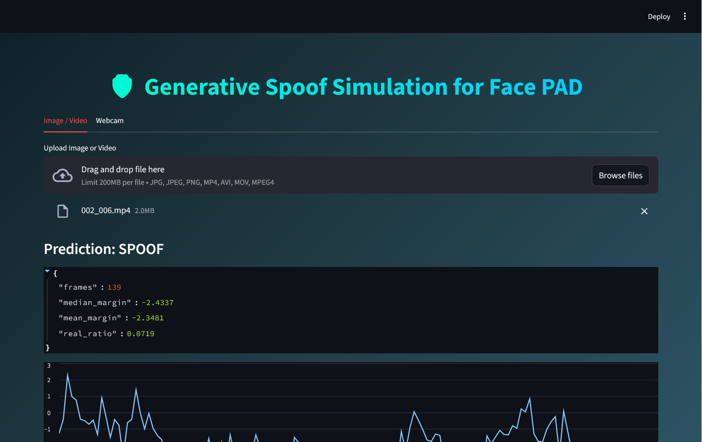
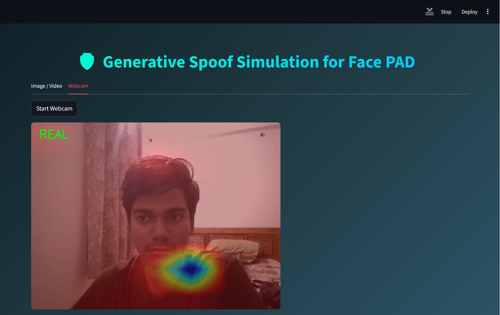
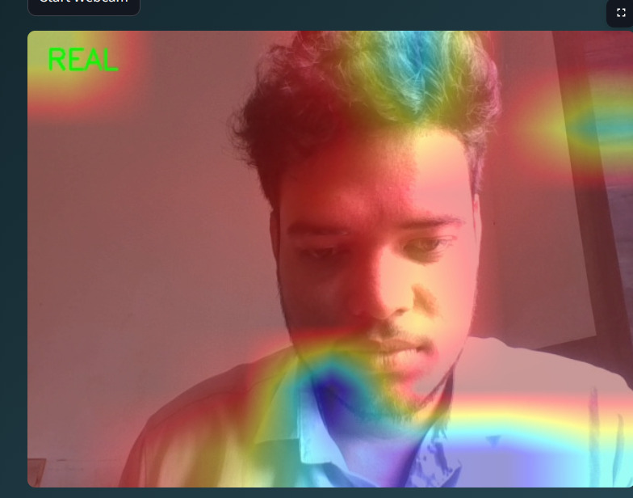

# Generative Spoofing for Face Presentation Attack Detection (PAD)

Overview

This project focuses on detecting face spoofing attacks using deep learning techniques. Face Presentation Attack Detection (PAD) is essential for securing biometric authentication systems against attacks such as printed photos, replay videos, and deepfake-based spoofing.

The system uses convolutional neural networks (CNNs) to classify input as real or spoof, achieving high accuracy through transfer learning and fine-tuning.


Objectives

* Detect spoof vs real faces
* Improve model robustness using fine-tuning
* Provide a user-friendly interface using Streamlit
* Visualize model attention using Grad-CAM

---

Models Used

* ResNet50 (Primary model) + VAE (finetuned)
* EfficientNet (optional experimentation)
* DenseNet (optional experimentation)
* ConvexNet (optional experimentation)

---

Performance

* Accuracy: ~98% (ResNet50)
* Evaluated using:

  * Precision
  * Recall
  * F1-score
  * Confusion Matrix

Tech Stack

* Python
* PyTorch
* Streamlit
* OpenCV
* NumPy
* Matplotlib

Features

* Image-based spoof detection
* Video-based spoof detection
* Live webcam detection
* Grad-CAM visualization for model explainability
* Clean and interactive Streamlit UI

Project Structure

```
Generative-Spoofing-PAD/
│
├── app.py
├── models/
│   └── finetuned_model.pth
├── notebooks/
│   └── training.ipynb
├── requirements.txt
├── README.md
└── .gitignore
```

---

 How to Run

### 1. Clone the repository

```
git clone https://github.com/sanjeev71-ops/Generative-Spoof-Simulation-For-PAD.git
cd Generative-Spoof-Simulation-For-PAD
```

### 2. Create virtual environment

```
python -m venv ml_gpu
ml_gpu\Scripts\activate
```

### 3. Install dependencies

```
pip install -r requirements.txt
```

### 4. Run the application

```
streamlit run app.py
```

---

 Demo Results

Real Image Detection


Spoof Image Detection


Real Video Detection


Spoof Video Detection


Webcam Detection 1


Webcam Detection 2

## ⚠️ Note

* Dataset is not included due to size limitations.
* For GPU acceleration, install PyTorch with CUDA support separately.

---

Future Improvements

* Real-time mobile deployment
* Better generalization for unseen spoof types
* Integration with cloud APIs

---

Authors
 
* Sanjeev Swain
* Chinmayee Sahoo

---

## 📄 License

This project is for academic purposes.
